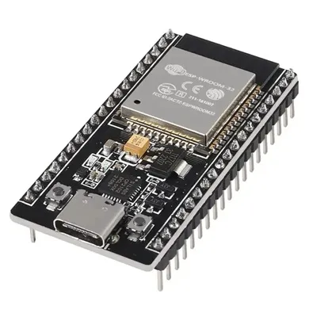
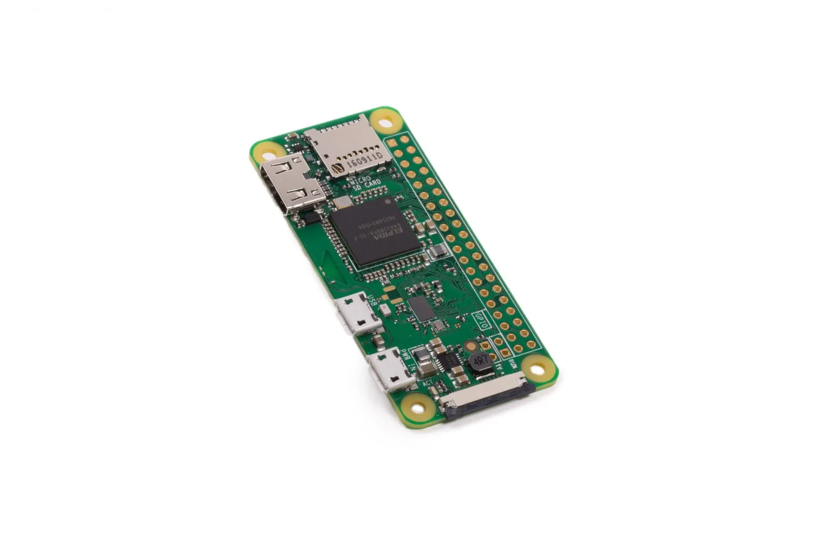
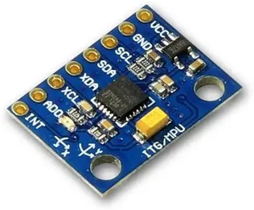
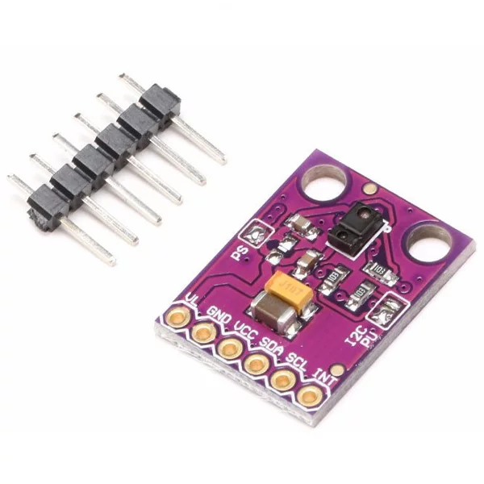
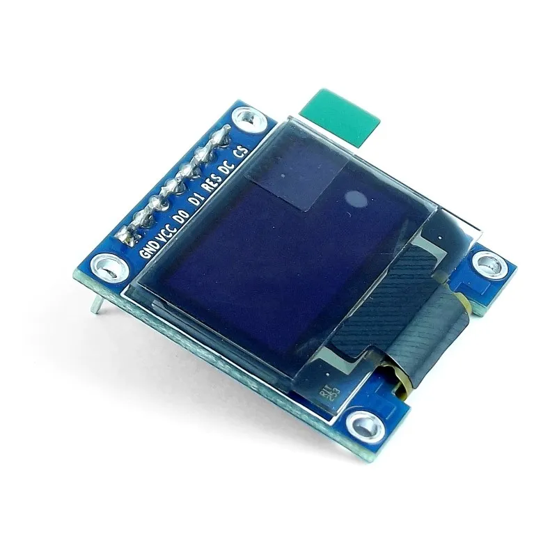
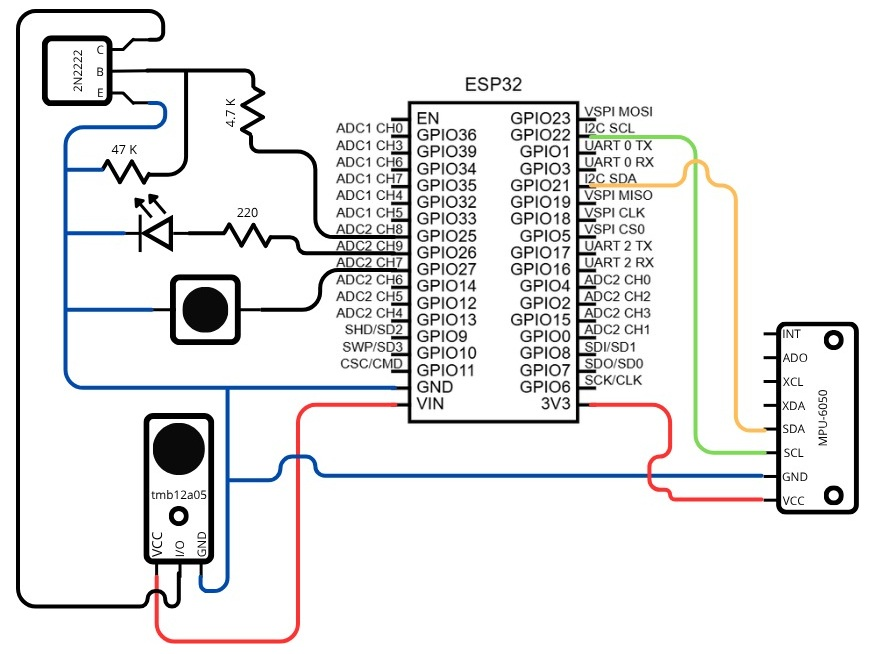
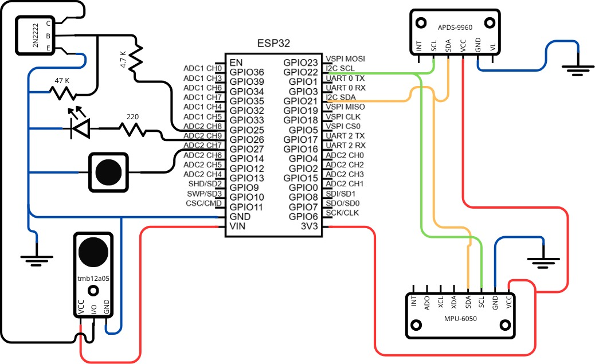
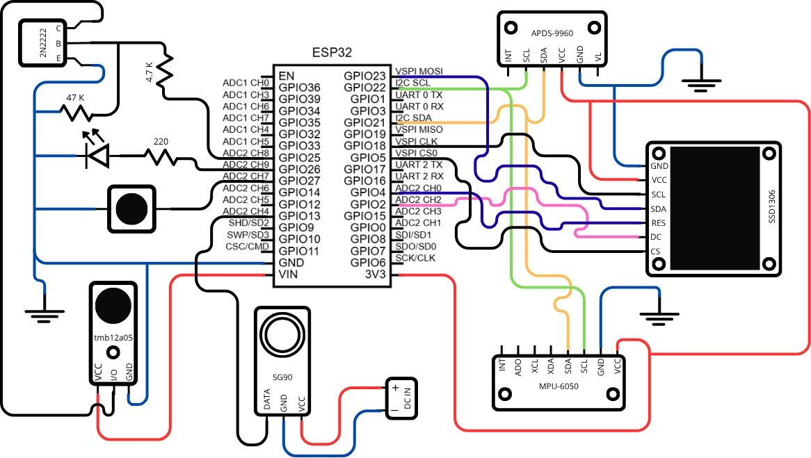
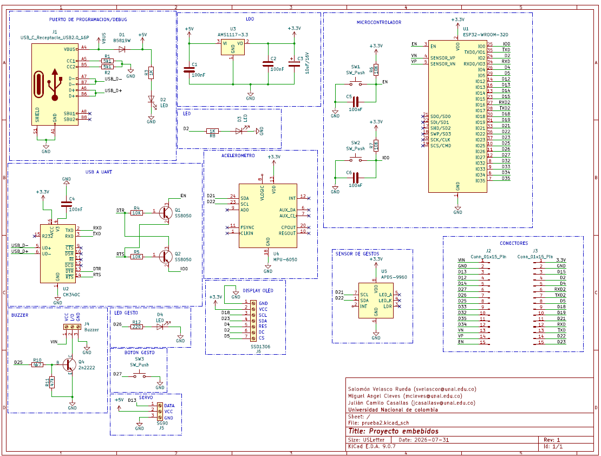

# Sistema Embebido Inalámbrico de Reconocimiento de Gestos

## Autores
- Julián Camilo Casallas (jcasallasv@unal.edu.co)
- Miguel Angel Cleves   (mcleves@unal.edu.co)
- Salomón Velasco Rueda (svelascor@unal.edu.co)

---

## Descripción
El Sistema Inalámbrico de Reconocimiento de Gestos consiste en el diseño e implementación de un sistema embebido inalámbrico capaz de reconocer gestos mediante la adquisición y procesamiento de señales provenientes de sensores de movimiento.
El sistema utiliza un microcontrolador basado en ESP32-WROOM-32D para capturar y procesar datos en tiempo real, los cuales son transmitidos de forma inalámbrica hacia una unidad de procesamiento central basada en Raspberry Pi Zero W.

En la Raspberry Pi se realiza el procesamiento adicional de los datos, así como la interpretación de patrones de movimiento para la identificación de gestos. El sistema puede generar respuestas como activación de actuadores, visualización de información o ejecución de acciones específicas según el gesto detectado.

---

## Objetivo General
Diseñar e implementar un sistema embebido inalámbrico que permita el reconocimiento de gestos en tiempo real mediante el uso de sensores de movimiento, procesamiento de datos y comunicación entre dispositivos.

---

## Objetivos Específicos
- Implementar la adquisición de señales de movimiento mediante sensores conectados al ESP32  
- Procesar y filtrar los datos obtenidos para la identificación de patrones de gestos  
- Diseñar una comunicación inalámbrica eficiente entre el ESP32 y la Raspberry Pi  
- Implementar un sistema de visualización o respuesta basado en los gestos reconocidos  
- Integrar técnicas básicas de clasificación (IA sencilla o reglas)  

---

## Arquitectura del Sistema

---

### Comunicación
- I2C (sensores y display)
- GPIO
- WiFi 

---

### Componentes

### Hardware

El sistema emplea los siguientes componentes físicos:

#### Microcontrolador
- ESP32-WROOM-32D

#### Microprocesador
- Raspberry Pi Zero W

#### Sensores
- Sensor de movimiento MPU6050
- Sensor de gestos APDS-9960

#### Actuadores

- LEDs 
- Buzzer
- Pantalla OLED SSD1306
- Servomotor SG90

### Software

El sistema se desarrolla utilizando diferentes herramientas de software:

#### ESP32:
- Programación en Arduino IDE o PlatformIO
- Lectura de sensores
- Procesamiento básico de señales
- Envío de datos vía WiFi
#### Raspberry Pi:
- Sistema operativo Linux
- Python
- Framework Flask para recepción de datos
- Procesamiento y clasificación de gestos

### Cambios en el diseño del circuito 

Durante el desarrollo del proyecto se realizaron diversas modificaciones en el diseño del circuito, con el objetivo de mejorar la integración de los componentes, optimizar las conexiones y garantizar el correcto funcionamiento del sistema.

Inicialmente, se planteó un diseño preliminar enfocado en la conexión básica de los sensores y actuadores al microcontrolador. Sin embargo, a medida que se avanzó en la implementación, se identificaron limitaciones relacionadas con la distribución de pines, la alimentación de los dispositivos y la organización general del circuito.

Por esta razón, se llevaron a cabo ajustes en la conexión de periféricos, la asignación de pines del ESP32 y la integración de los módulos de comunicación y visualización.

A continuación, se presentan las diferentes iteraciones del diseño:

  
  

Finalmente, se obtuvo un diseño definitivo que integra todos los componentes del sistema de manera funcional y organizada, cumpliendo con los requerimientos del proyecto:

  

---

## Estructura del Proyecto

### Pruebas de Funcionamiento

Antes de integrar todos los componentes en un solo sistema, se realizaron pruebas individuales para verificar el correcto funcionamiento de cada dispositivo hardware:

#### 1. Prueba de sensores y calibración 

#### 3. Prueba de comunicación y monitoreo serial

Se validó la comunicación del sistema mediante la verificación de la correcta transmisión y visualización de los datos en el monitor serial del entorno de desarrollo. Durante esta prueba se comprobó la actualización continua de las mediciones y la estabilidad de los valores adquiridos, garantizando un flujo de información confiable desde los sensores.

  
  

#### 2. Prueba previa de actuadores

Se evaluó el funcionamiento del servomotor SG90 mediante la generación de señales PWM a 50 Hz, verificando un movimiento suave en el rango de 0° a 180° y ajustando los anchos de pulso correspondientes.

Adicionalmente, se validó la visualización de los datos y del ángulo resultante a través de la pantalla OLED, comprobando la correcta integración entre el sistema de control y la interfaz de visualización.

  
  

#### 3. Integración Final

Una vez validados la pantalla y el actuador por separado, se unificaron en el programa principal para coordinar el movimiento físico del servo con el indicador en pantalla.

### Esquemático del sistema

El esquemático del sistema representa la interconexión de los diferentes módulos electrónicos utilizados en el proyecto, incluyendo el microcontrolador ESP32, los sensores, los actuadores y los elementos de alimentación.

En el diseño se observa la integración del ESP32 como unidad central de control, encargado de la adquisición de datos provenientes de los sensores de movimiento. Estos sensores se comunican principalmente mediante protocolos digitales como I2C, permitiendo una conexión eficiente y reduciendo el número de pines utilizados.

Adicionalmente, se incluyen los actuadores del sistema, tales como el servomotor, el buzzer y los indicadores visuales, los cuales son controlados mediante señales PWM y salidas digitales del microcontrolador.

El circuito también contempla los elementos necesarios para la correcta operación del sistema, como el suministro de alimentación, conexiones de referencia (GND) y posibles etapas de desacople para garantizar estabilidad en las señales. Este esquemático constituye la base para el diseño de la PCB y la implementación física del sistema, asegurando la correcta integración de todos los componentes.

  

  📄 Ver esquemático completo en PDF

